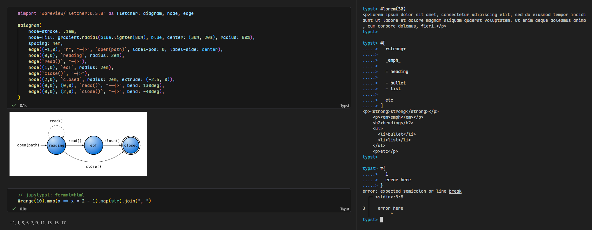

# jupytypst

`jupytypst` is a Jupyter kernel and terminal REPL for Typst.

It keeps session state across cells or REPL inputs and can render output as SVG or HTML. The default source mode is Typst markup mode; code mode is also available.



## Install

Install from Git:

```sh
cargo install --git https://github.com/ParaN3xus/jupytypst jupytypst
```

Install the Jupyter kernelspecs:

```sh
jupytypst install --user --replace
```

This installs both `Typst` markup mode and `Typst (Code Mode)`.

After installing, restart your editor/Jupyter client or Jupyter server if the
kernel does not appear immediately.

## Usage

Start the Jupyter kernel through the installed kernelspec, or run it directly:

```sh
jupytypst start --connection-file <connection.json>
```

Run the terminal REPL:

```sh
jupytypst repl
```

Markup mode uses normal Typst document syntax:

```typ
Hello from Typst

#let f(a, b) = a + b
#f(1, 2)
```

Code mode can be selected with `--mode code` or the code-mode kernelspec:

```typc
let f(a, b) = a + b
f(1, 2)
```

The default output format is SVG for notebooks and HTML for the REPL. Notebook
cells can override the format with:

```typ
// jupytypst: format=html
```

Supported formats are currently `svg` and `html`.

## License

This project is licensed under the Apache License 2.0. See [LICENSE](LICENSE).

## Legal

This project is not affiliated with, created by, or endorsed by Typst the brand.
